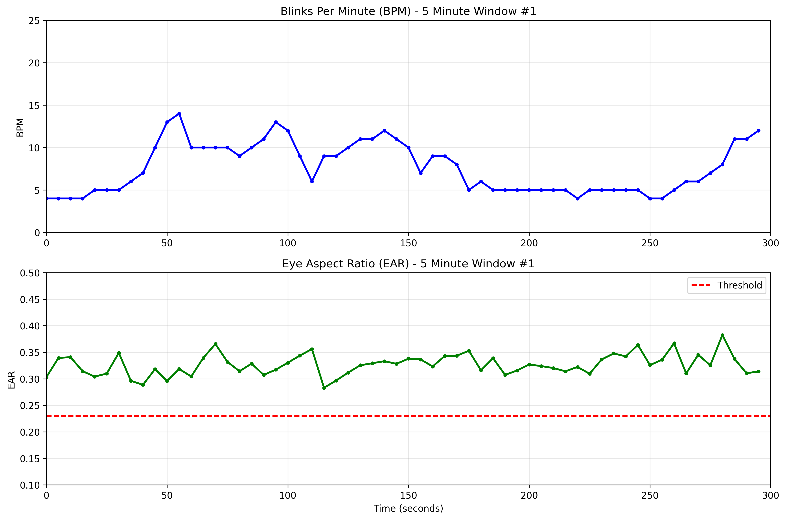

# Blink Rate Monitor

A simple real-time blink detector using your webcam. Uses YOLOv8 for face detection and MediaPipe for eye tracking.

## What it does

- Counts your blinks in real time
- Shows blinks per minute (BPM)
- Displays live graphs of your blink rate and eye openness
- Helps monitor eye strain during screen time

## Demo


Example output graph showing 5-minute blink rate analysis:



## Setup

Install the required packages:

```bash
pip install -r requirements.txt
```

Run the program:

```bash
python blink_detector.py
```

## Controls

- **q** - Quit
- **r** - Reset blink counter
- **c** - Auto-calibrate blink threshold
- **+/-** - Adjust blink sensitivity
- **s** - Change performance settings
- **p** - Toggle graphs on/off

## How it works

1. **Face detection** - Finds your face using YOLOv8
2. **Eye tracking** - Uses MediaPipe to track 6 points around each eye
3. **Blink detection** - Calculates Eye Aspect Ratio (EAR). When EAR drops below threshold = blink
4. **BPM calculation** - Counts blinks over the last 60 seconds

## Display

**Main window**: Video feed with face box, eye points, and stats overlay
**Graph window**: Live charts showing BPM and eye openness over time

## Troubleshooting

- **No blinks detected?** Press 'c' to calibrate or use +/- to adjust sensitivity
- **Low FPS?** Press 's' to reduce face detection frequency
- **Graphs crash?** Press 'p' to disable them - main detection still works

## Eye Aspect Ratio (EAR)

EAR measures how open your eyes are:
- **Open eyes**: ~0.25-0.35
- **Closed eyes**: ~0.10-0.18
- **Threshold**: Usually around 0.23 (adjustable)

Normal blink rate is 15-20 per minute. Higher rates may indicate eye strain or fatigue.
